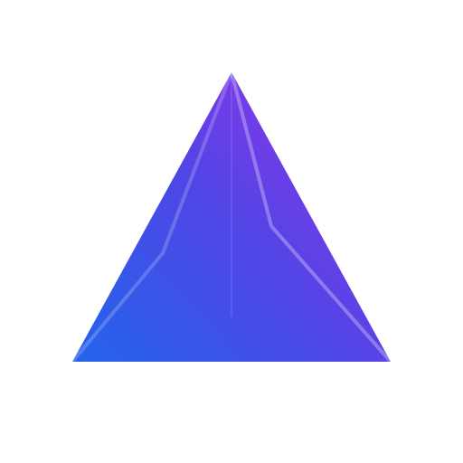

<!-- ═══════════════════════════════════════════════════════════════════════════ -->
<!--                         HEADER: ANIMATED TYPING                             -->
<!-- ═══════════════════════════════════════════════════════════════════════════ -->

</a>

<!-- ═══════════════════════════════════════════════════════════════════════════ -->
<!--                        COMMAND CENTER: STATS GRID                           -->
<!-- ═══════════════════════════════════════════════════════════════════════════ -->

<h2 style="color: #f7c9cc;">⚡ COMMAND CENTER</h2>

<table border="0" width="100%">
  <tr>
    <td width="50%" align="center">
      
    </td>
    <td width="50%" align="center">
      
    </td>
  </tr>
</table>

<!-- ═══════════════════════════════════════════════════════════════════════════ -->
<!--                          FEATURED PROJECTS                                   -->
<!-- ═══════════════════════════════════════════════════════════════════════════ -->

<h2 style="color: #f7c9cc;">🎯 FEATURED PROJECTS</h2>

<table width="100%" border="0">
  <tr>
    <td width="50%" valign="top">
      

        
        <h3 style="color: #f7c9cc;">💎 PRISM</h3>
        
<i>Visual intelligence, refined.</i>

      

      

        A next-generation visual intelligence platform combining Google Cloud Vision and Tesseract.js for complex data extraction. Enhanced by Google's Generative AI for deep contextual understanding.
      

      

        
        
        
        
      

    </td>
    <td width="50%" valign="top">
      

        
        <h3 style="color: #f7c9cc;">👁️ EVIDEX</h3>
        
<i>Evidence indexed, intelligence expanded.</i>

      

      

        Advanced legal document analysis platform designed for professionals. Streamlines complex workflows by extracting text and generating actionable insights using DeepSeek LLM.
      

      

        
        
        
        
      

    </td>
  </tr>
</table>

<!-- ═══════════════════════════════════════════════════════════════════════════ -->
<!--                      LANGUAGE & ACTIVITY ANALYTICS                          -->
<!-- ═══════════════════════════════════════════════════════════════════════════ -->

<h2 style="color: #f7c9cc;">📊 CODE ANALYTICS</h2>

  

<!-- ═══════════════════════════════════════════════════════════════════════════ -->
<!--                         TECHNOLOGY STACK                                     -->
<!-- ═══════════════════════════════════════════════════════════════════════════ -->

<h2 style="color: #f7c9cc;">🛠️ AI/ML TECHNOLOGY STACK</h2>

  

<!-- ═══════════════════════════════════════════════════════════════════════════ -->
<!--                    LIVING FOOTER: SNAKE ANIMATION                           -->
<!-- ═══════════════════════════════════════════════════════════════════════════ -->

<h2 style="color: #f7c9cc;">🐍 CONTRIBUTION GRAPH</h2>

<picture>
  <source media="(prefers-color-scheme: dark)" srcset="https://raw.githubusercontent.com/Kaffan9441/kaffan9441/output/github-contribution-grid-snake-dark.svg">
  <source media="(prefers-color-scheme: light)" srcset="https://raw.githubusercontent.com/Kaffan9441/kaffan9441/output/github-contribution-grid-snake.svg">
  
</picture>

<!-- ═══════════════════════════════════════════════════════════════════════════ -->
<!--                         SOCIAL LINKS                                         -->
<!-- ═══════════════════════════════════════════════════════════════════════════ -->

<h2 style="color: #f7c9cc;">🔗 CONNECT</h2>

  

