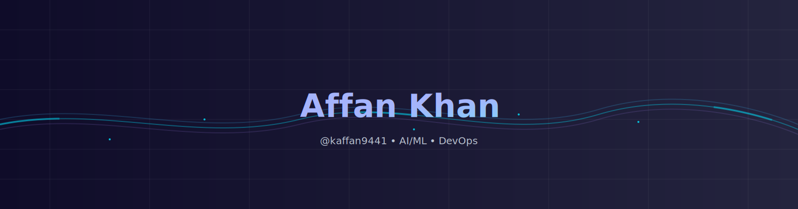

<!-- Animated banner with your name (kept) -->

   
  
  
  
    
  <em>Turning ideas into useful tools.</em>
    
  <!-- Optional typing line: uncomment the next  if you want it -->
  <!--
  
  -->

---

### About Me
- 🎓 Second-year Software Engineering @ McMaster  
- 🧪 I like turning homework hacks into actual tools  
- 🔭 Learning: CI/CD and Verilog/FPGA  
- 📫 Reach me: <a href="mailto:kaffan9441@gmail.com">kaffan9441@gmail.com</a>

### Quick Overview
- 🚀 Building: small tools and UIs that solve daily problems  
- 🤝 Open to: SWE/AI/DevOps internships  
- 🧰 Toolkit: Git, GitHub Actions, Docker, VS Code

### Tech Stack & Skills

  
  
  
  
  
  
  
  
  
  
  

### Stats

  
  

### Contributions (animated)

  <picture>
    <source media="(prefers-color-scheme: dark)" srcset="https://raw.githubusercontent.com/Kaffan9441/kaffan9441/output/github-contribution-grid-snake-dark.svg" />
    <source media="(prefers-color-scheme: light)" srcset="https://raw.githubusercontent.com/Kaffan9441/kaffan9441/output/github-contribution-grid-snake.svg" />
    
  </picture>

